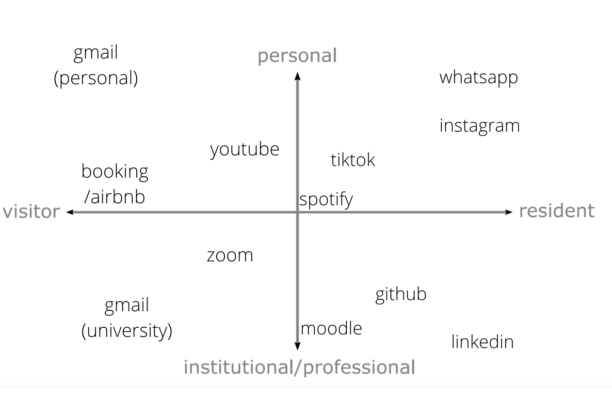

# How can the existential risk of a Nuclear holocaust be reduced by our digital identity?

## The first step towards decreasing the existential risk is awareness
Our digital identities can be used to inform the public of these risks and raise awareness of important topics that can lead in extreme cases to human extinction. 
In this case, I have chosen a Nuclear holocaust as an important existential risk. 

## Nuclear risk is real 
Due to the war between Russia and Ukraine Europe and the rest of the world have seen how easy is for a country to threaten with a nuclear attack. 
The continued offensives by both sides have put the safety of Ukraine's nuclear power plants at risk. Shelling of Ukrainian energy infrastructure continues as Russian forces in the Donbas threaten to carry out an "all-out attack" on Ukraine.

In fact Russia has in the last few weeks conducted a nuclear test attack, which Russian President Vladimir Putin himself says the potential for conflict around the world remains very high. 
Seeing how easy it would be for a country to launch a massive nuclear attack, how can we use our digital identities to try to reduce this existential risk? 

## Digital identities used to protect citizens 
Actually, citizens have already started to use their digital identities to increase their security in case of nuclear attack. 
This is the case of the citizens in a region of Spain, called Tarragona, where thermal and nuclear power plants are located, have used their digital identities to alert the population in case of a gas leak or fire. 
It all started when there was a major fire at one of the plants a few months ago, and the public was not alerted until 5 hours later. During this time, citizens experienced moments of tension and uncertainty, as the smell of gas was present throughout the city and the flames could be seen for miles around. People began to share pictures on tweets or WhatsApp and fake news was quick to appear. 
It was after this episode that it became clear that there was a need to create a kind of immediate official governmental warning that could alert the public via personal phone of such incidents.

our digital identities may not be able to stop a catastrophe, but they can help protect the maximum number of people from it by creating a way to alert the population.

## The real case of mobile alerts in Spain  
Spain has already started testing the new disaster alert a few days ago. 
The Directorate General of Civil Protection oversees launching this new system of alerts to the population called ES-Alert, which will send warnings directly to the mobile phones of citizens affected by a possible emergency or catastrophe. This system has been tested in all communities. Many phones will receive a text alert accompanied by a beep warning of an impending emergency.

## Moral questions to take into account  
Somehow therefore, mobile phones will be tracked and disrupted by this signal, and although most of the population believes it is a good way to be alerted, to what extent would the government be invading our privacy, and collecting data on our digital identities? So, who is going to handle this data and for what purpose?  

Below you see an example of embedding an image that is found in another repository:

. 

## Embedding video players

<iframe width="560" height="315" src="https://www.youtube.com/embed/lfPJ7Tz4JGs" title="YouTube video player" frameborder="0" allow="accelerometer; autoplay; clipboard-write; encrypted-media; gyroscope; picture-in-picture" allowfullscreen></iframe>

## More examples

Make sure you check out the [Markdown language](https://guides.github.com/features/mastering-markdown/) guide. 

